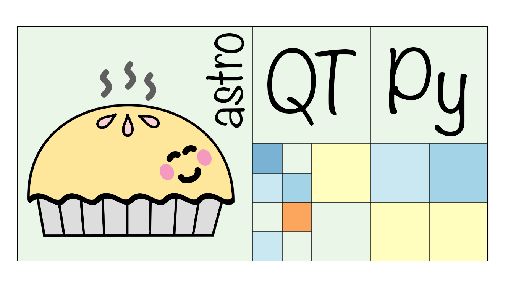

 

    

<h1 align="center">Efficient 2D mapping for astronomers</h1>

    
    
    
    
    

Welcome to `astroQTpy` (Astronomy Quad Trees in Python), a Python package for efficiently mapping 2D parameter space using quadtrees. For installation instructions, tutorials, and detailed documentation: [read the docs](https://astroqtpy.readthedocs.io/en/latest/)!