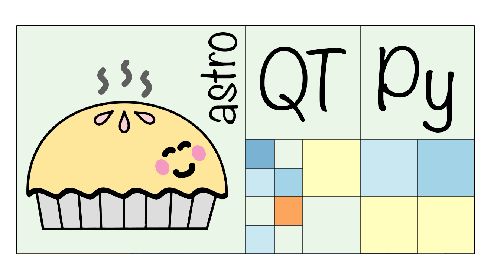

.. |br| raw:: html

    

astroQTpy
=========

Hello! Welcome to the documentation for ``astroQTpy`` (Astronomy Quad Trees in Python), a Python
package for efficient mapping of a 2-D paramater space.

Attribution:
++++++++++++

* If you use ``astroQTpy`` in your work, please cite ...

User Guide:
+++++++++++

.. toctree::
   :maxdepth: 2

   quickstart
   installation
   tutorials
   api

Changelog:
++++++++++

**0.1.1 (2023-07-26)**

- First release on Zenodo (@CalebHarada)

   

