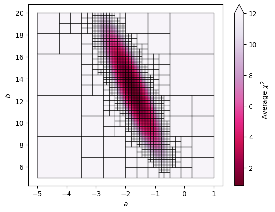
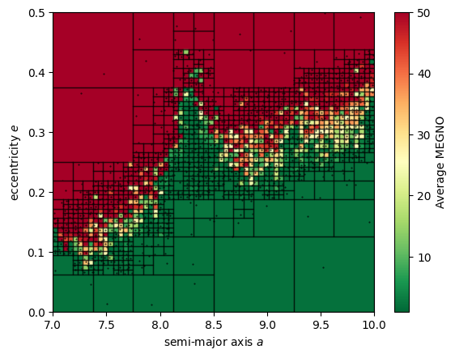

.. _home:

.. image:: img/astroQTpy_logo_withtext.png
   :width: 60%
   :align: center

.. raw:: html

   <h1 align="center">Efficient 2D mapping for astronomers</h1>

   

   

      
      
      
      
      
   

   

      Hello! Welcome to the documentation for <code style="color:red">astroQTpy</code> (Astronomy Quad Trees in Python), 
      a Python package for efficiently mapping 2D paramater space using quadtrees.
   

    

What is astroQTpy?
------------------

``astroQTpy`` makes it easy to implement `quadtree <https://en.wikipedia.org/wiki/Quadtree#:~:text=A%20quadtree%20is%20a%20tree,into%20four%20quadrants%20or%20regions.>`_ 
data structures in your astronomical research. Quadtrees are an efficient way to partition a two-dimensional space by recursively subdividing it into 
four equal quadrants (or nodes). 

In practice, this can speed up your simulations or data analysis by focusing your computational resources on regions of parameter space where large 
gradients or inhomogeneities exist. In other words, you don't have to waste time computing models where you know large areas of your parameter 
space yield similar results because ``astroQTpy`` quadtrees automatically subdivide where inhomogeneities exist.

As an added bonus, quadtrees look really cool when you plot them. Nice!

To get started using ``astroQTpy``, check out the :ref:`quickstart` guide or follow along with the :ref:`tutorials`.

Why use quadtrees?
------------------

There are many potential applications of quadtrees in astronomical research! In general, quadtrees can be useful just about anywhere 
you need to plot some values as a function of two independent variables. 

Just to name a few examples where you might use a quadtree:

* Grid-based approach to model optimization.

   - E.g., plotting :math:`\chi^2` as a function of two model parameters.

* N-body simulation grids.

   - E.g., MEGNO as a function of two orbital elements.

* Pipeline sensitivity maps.

   - E.g., Exoplanet transit injection/recovery tests as a function of :math:`R_p/R_*` and period.

.. Note::
   
   ``astroQTpy`` is a living project that will be continually updated and upgraded over time. Check back for updates 
   or feel free to give us suggestions by `creating a new issue on GitHub <https://github.com/CalebHarada/astroQTpy/issues>`_. 
   You can also define your own custom ``astroQTpy`` class -- check out the tutorials for more info!

Attribution:
++++++++++++

* If you use ``astroQTpy`` in your work, please cite our `Zenodo <https://zenodo.org/record/8190984>`_:

.. code-block:: TeX

   @software{harada_astroQTpy_2023,
      author       = {Caleb K. Harada},
      title        = {astroQTpy},
      month        = July,
      year         = 2023,
      publisher    = {Zenodo},
      version      = {},
      doi          = {10.5281/zenodo.8190984},
      url          = {https://doi.org/10.5281/zenodo.8190984}
   }

* If you use `REBOUND <https://rebound.readthedocs.io/en/latest/>`_ or any of dependencies,
  please also cite those. The simplest way to find the citations relevant to the specific setup of your ``REBOUND`` simulation is:

.. code-block:: python

   sim = rebound.Simulation()
   -your setup-
   sim.cite()

User Guide:
+++++++++++

.. toctree::
   :maxdepth: 2

   quickstart
   installation
   tutorials
   api

Changelog:
++++++++++

**0.1.3 (2023-07-28)**

- New tutorials, update docs, etc. (@CalebHarada)

**0.1.2 (2023-07-27)**

- Update docs, etc. (@CalebHarada)

**0.1.1 (2023-07-26)**

- First release on Zenodo (@CalebHarada)

   

