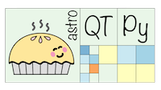

.. astroQTpy documentation master file, created by
   sphinx-quickstart on Mon Jul 17 12:36:10 2023.
   You can adapt this file completely to your liking, but it should at least
   contain the root `toctree` directive.

Welcome to astroQTpy's documentation!
=====================================

.. toctree::
   :maxdepth: 2
   :caption: Contents:

   quickstart
   installation
   tutorials
   api

